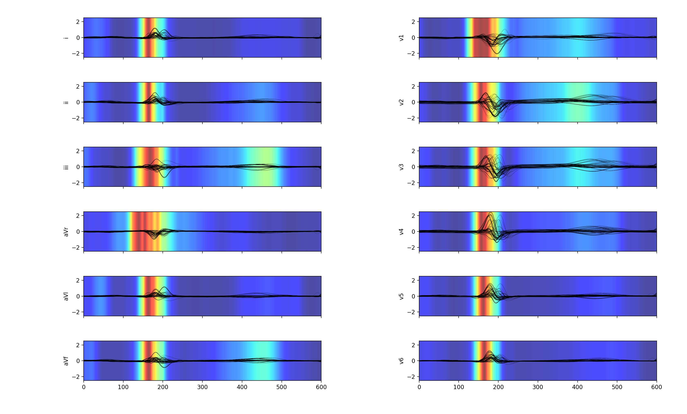

# ECG_neuralnet

A convolutional neural net made using keras and tensorflow. Trained to identify myocardial infactions from ECG recordings.  Trained on 148 patients with MI and 52 healthy controls in the online PTBDB database (not included). Pan-Tomkins algorithm is implemented and used for R-wave detection. 

10-fold cross validation achieves
95 % sensitivity
94 % specificity

However, turns out that most of the ECG recordings were taken long after MI presentation which is evident by the salience map of all correctly predicted MIs below. It is actually identifying Q-waves not ST-elevation or the likes. 

